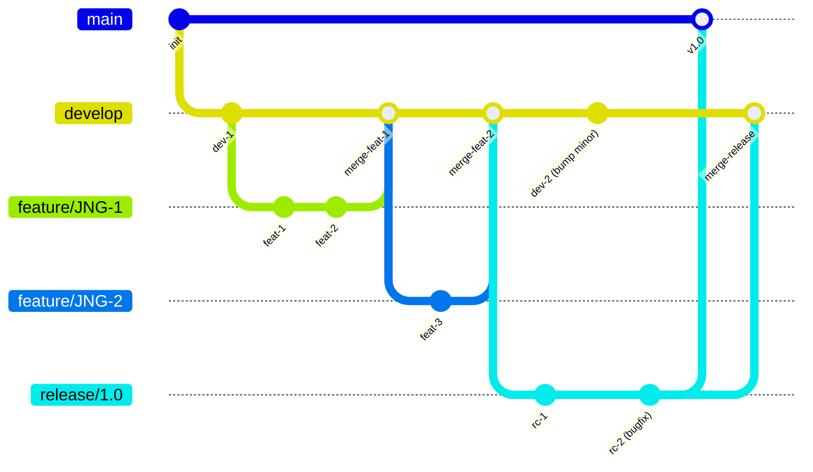
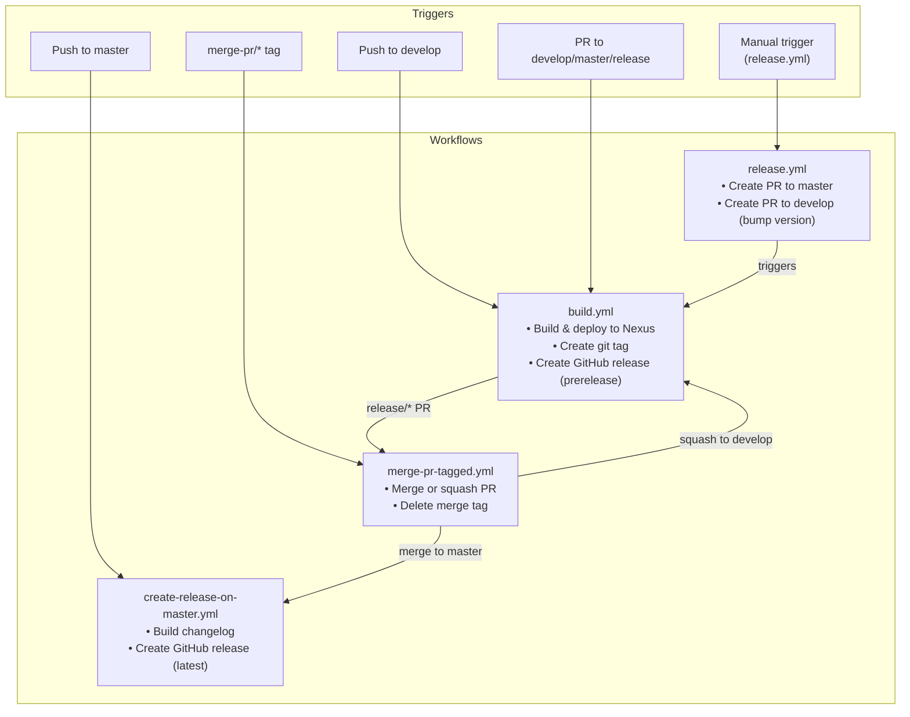

# Development Version and Branch Handling

This document describes the GitFlow-based branching strategy and CI/CD pipeline used by JUDO NG modules.

## Branches

The versioning policy is based on [GitFlow](https://www.atlassian.com/git/tutorials/comparing-workflows/gitflow-workflow). Each branch type serves a specific purpose in the development lifecycle:

| Branch Pattern | Base | Purpose |
|---------------|------|---------|
| `develop` | — | Main development branch; contains latest development sources |
| `feature/JNG-NUMBER_summary` | `develop` | New features for the next release |
| `(release/)X.Y.Z` | `develop` | Release candidates being stabilized; the `release/` prefix is reserved for CI |
| `bugfix/JNG-NUMBER_summary` | release branch | Bug fixes applied during release testing |
| `support/JNG-NUMBER_summary` | release branch | Minor changes to a previous release |
| `master` | — | Latest released sources of the last active version |
| `hotfix/JNG-NUMBER_summary` | `master` | Critical fixes applied to production and backported |

## Version Numbers

Version numbers follow semantic versioning with these rules:

| Event | Version Change |
|-------|---------------|
| Start a `feature/` branch | No change (inherits from `develop`) |
| Start a `release/` branch | 2nd number on `develop` is incremented |
| `bugfix/` branch on release | No change (fixes applied before release) |
| Start a `support/` branch | 3rd number is incremented |
| Start a `hotfix/` branch | 4th number is incremented |

## GitHub Actions Workflows

The CI/CD pipeline consists of several interconnected workflows:

### build.yml

Triggered on pushes to `develop` and pull requests targeting `develop`, `master`, `increment/*`, or `release/*` branches.

**Version resolution:**
- For `master` and `release/*` branches: uses the POM version as-is (without `-SNAPSHOT`)
- For `develop` and `increment/*` branches: appends a qualifier with date, commit ID, and branch name

**Steps:**
1. Build and deploy artifacts to Nexus
2. Create a git tag `v<version>`
3. For `increment/*` and `release/*` PRs: create a `merge-pr/<version>` tag (triggers `merge-pr-tagged.yml`)
4. For `develop` pushes: build changelog and create a GitHub prerelease

### merge-pr-tagged.yml

Triggered when a `merge-pr/*` tag is pushed.

- If version is `major.minor.qualifier` format → merge PR to `master` (triggers `create-release-on-master.yml`)
- Otherwise → squash PR to `develop` (triggers `build.yml`)
- Deletes the `merge-pr/<version>` tag after processing

### release.yml

Manually triggered with a version parameter (`auto` or a specific `major.minor.qualifier`).

1. Resolves the release version (from POM if `auto`)
2. Creates a PR to `master` with the release version
3. Creates a PR to `develop` with the next incremented version
4. Both PRs trigger `build.yml`

### create-release-on-master.yml

Triggered on pushes to `master`. Builds a changelog and creates the final GitHub release (marked as "latest").

## Development Rules

> **Important:** There is no commit without a ticket number. Every pull request or commit must include a JIRA reference like `JNG-xxx`.

Issue tracking: [JIRA Dashboard](https://blackbelt.atlassian.net/jira/dashboards)
