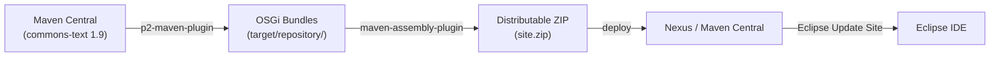
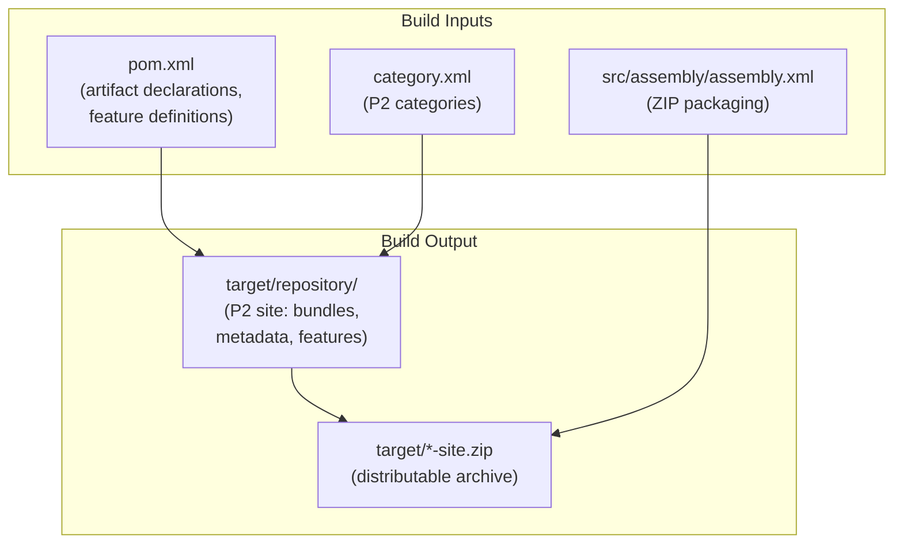

# judo-misc-p2

[](https://github.com/BlackBeltTechnology/judo-misc-p2/actions/workflows/build.yml)

## Introduction

This project creates an Eclipse P2 update site that repackages third-party Maven dependencies as OSGi bundles. Eclipse-based tooling (such as the JUDO platform's IDE components) can then consume these libraries through the standard Eclipse update-site mechanism instead of manually managing JARs.

The P2 site currently bundles:

| Feature | Artifact | Version | Transitive | Source |
|---------|----------|---------|------------|--------|
| `apache.commons.text.feature` | `org.apache.commons:commons-text` | 1.9 | Yes | Yes |

## How It Works



The build pipeline uses the [reficio p2-maven-plugin](https://github.com/reficio/p2-maven-plugin) to:

1. **Resolve** the declared Maven artifacts (including transitive dependencies)
2. **Wrap** each JAR as an OSGi bundle with proper `MANIFEST.MF` metadata
3. **Generate** P2 metadata (`content.jar`, `artifacts.jar`) so Eclipse can discover and install the bundles
4. **Package** the resulting repository directory into a distributable ZIP via `maven-assembly-plugin`

## Usage

Download the P2 site ZIP from Maven Central and point Eclipse at it:

```
http://repo1.maven.org/maven2/hu/blackbelt/eclipse/judo-misc-p2/${VERSION}/judo-misc-p2-${VERSION}-site.zip!/
```

Or use the Nexus-hosted P2 repository directly (for snapshot versions):

```
https://nexus.judo.technology/repository/p2-judong/judo-misc-p2/${VERSION}/
```

## Adding a New Dependency

To add a new library to the P2 site:

1. Add an `<artifact>` entry inside the `<feature>` block (or create a new `<feature>`) in the `p2-maven-plugin` configuration in `pom.xml`
2. Add a corresponding `<feature>` and `<category-def>` entry in `category.xml`
3. Run `./mvnw clean package` and inspect `target/repository/` to verify the bundles

## Build Commands

```bash
# Build and install locally
./mvnw clean install

# Package only (produces target/repository/ and the ZIP)
./mvnw clean package

# Deploy to JudoNG Nexus
./mvnw -Prelease-judong deploy

# Upload P2 repo to Nexus via WebDAV
./mvnw -Prelease-p2-judong deploy

# Deploy to Maven Central
./mvnw -Psign-artifacts,release-central deploy
```

## Project Structure



## Context

This project is a building block of the [judo-community](https://github.com/BlackBeltTechnology/judo-community) aggregator project. Please check the corresponding documentation to understand how this module fits into the broader JUDO ecosystem.

## Contributing

Everyone is welcome to contribute to JUDO! Please read the [CONTRIBUTING](CONTRIBUTING.md) guide for details.

## License

This project is licensed under the [Eclipse Public License - v 2.0](https://www.eclipse.org/legal/epl-2.0/).
